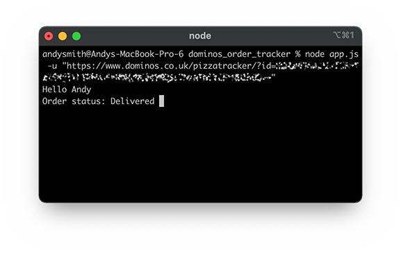

Quick and dirty command line tracker written while I was waiting for a pizza to arrive. 
Paste in a Dominos UK tracker URL and it will update every 10 seconds in your terminal. 

I will add more features next time I order a pizza. 

To install, clone and run: 

    npm install 

To run: 

     node app.js -u "https://www.dominos.co.uk/pizzatracker/?id=xxxxxxxxx"